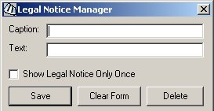



## Legal Notice Manager

### Description

Allows you to change the Legal Notice displayed prior to the Windows Logon screen. It also allows you to remove (delete) the Legal Notice. So far as I have tested it, it works on WIN9x and WIN2K boxes. Anybody out there with WINXP checks it let me know if it works.
 
### More Info
 
It's a complete application that relies on standard Microsoft Windows and Microsoft Visual Basic runtime libraries--no extra or 3rd party libraries are required nor created.

Compile the code before selecting the "Show Legal Notice Only Once" checkbox, otherwise windows will error trying to load the application. Compiling and running the application, checking that box, and saving will fix the error.

None that I know of.

             |
---                |---
**Submitted On**   |2003-06-15 13:47:26
**By**             |[KenKnutson](https://github.com/Planet-Source-Code/PSCIndex/blob/master/ByAuthor/kenknutson.md)
**Level**          |Intermediate
**User Rating**    |5.0 (10 globes from 2 users)
**Compatibility**  |VB 6\.0
**Category**       |[Complete Applications](https://github.com/Planet-Source-Code/PSCIndex/blob/master/ByCategory/complete-applications__1-27.md)
**World**          |[Visual Basic](https://github.com/Planet-Source-Code/PSCIndex/blob/master/ByWorld/visual-basic.md)
**Archive File**   |[Legal\_Noti1601126152003\.zip](https://github.com/Planet-Source-Code/kenknutson-legal-notice-manager__1-46195/archive/master.zip)

